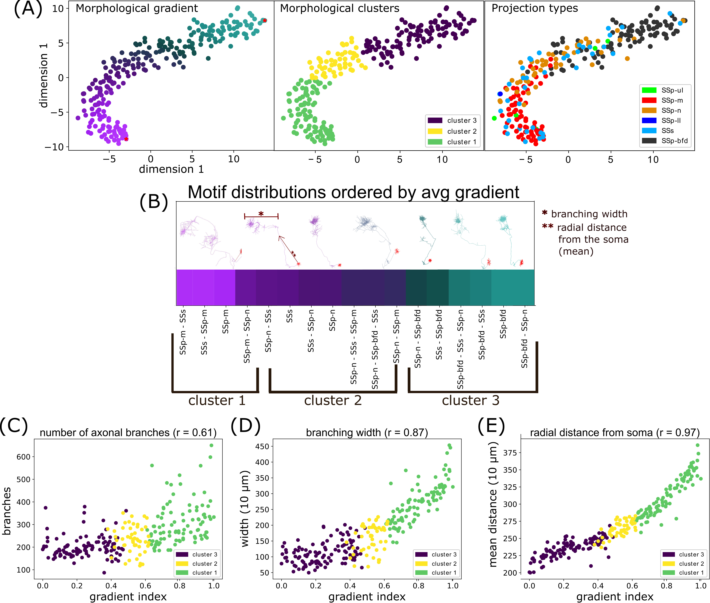

# Neuron_Aligner
Given a list of publicly available morphologies whose soma location resides in an anatomical area of interest, Neuron_Aligner finds a target neuron that is the most morphologically similar to a source neuron that has been pre-selected by a user.

## References
This code has been used in the following published work:
Timonidis, Nestor, et al. "Translating single-neuron axonal reconstructions into meso-scale connectivity statistics in the mouse somatosensory thalamus." Frontiers in neuroinformatics 17 (2023): 1272243. doi: 10.3389/fninf.2023.1272243

